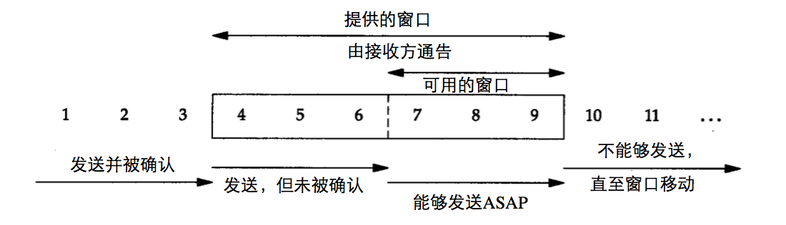
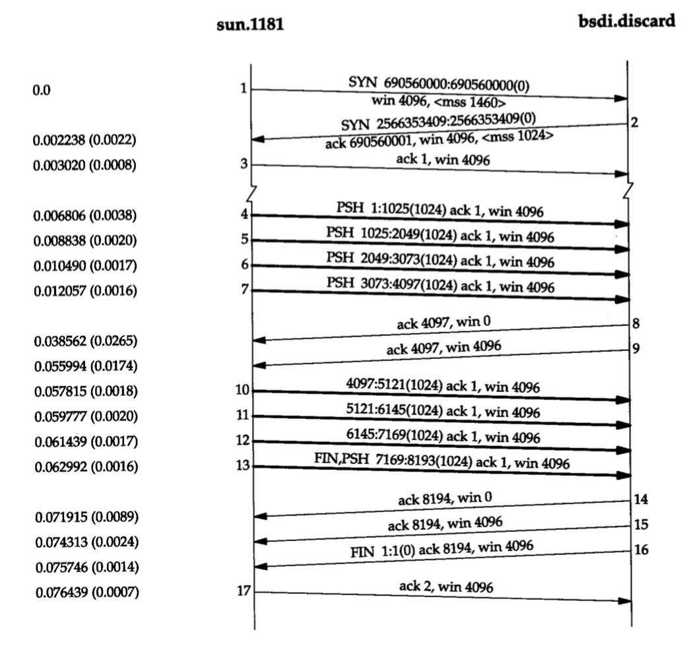
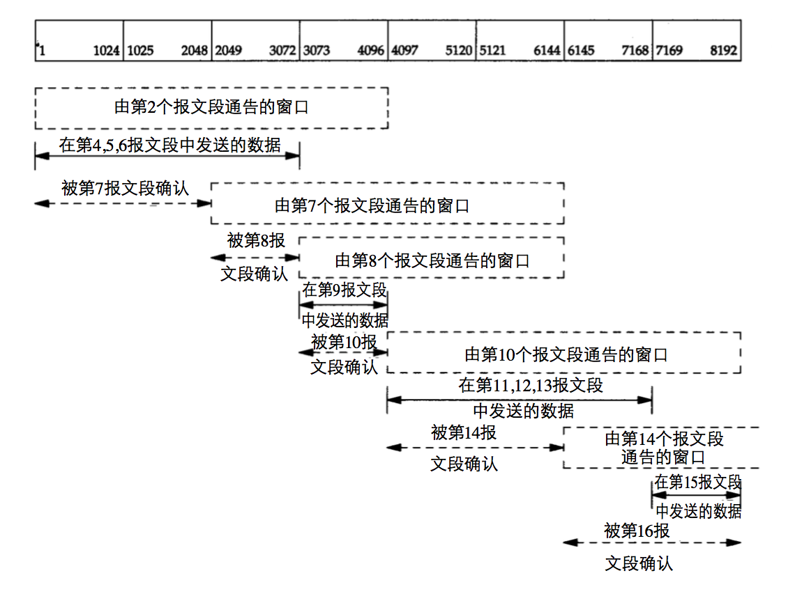

# TCP协议与网络编程 零散学习心得
---

- TCP连接建立的三次握手：TCP连接建立的主要流程是：A端发送SYN -> B端回复ACK/SYN -> A端回复ACK。  
发送SYN的时候，会带上初始序列号、滑动窗口大小、可以接受的最大分片等信息。其中最大分片信息用于限定发送方每个TCP报文的长度，如果超过这个长度，就会被IP层分片，而IP层的分片是不可靠的传输，所以分片需要由TCP来完成。  
在实际的实现中，内核使用两个队列完成对连接的管理，一个称为半连接队列，一个称为accept队列。  
服务端对一个socket进行监听，当收到客户端发来连接请求时（即收到SYN），内核会把SYN放入这个socket的半连接队列，这个队列的默认长度是1024，但如果开启了syncookies功能，那就相当于没有限制。  
如果一个连接完成了三次握手，进入established状态，那么内核会把这个连接放入accept队列，等待应用层取走。这个队列默认长度为128，如果满了，后面的连接会被drop掉。当应用层调用accept方法时，内核会从这个队列取出连接的信息，生成一个新的socket，然后给应用层返回socket的文件描述符。

- TCP连接关闭的四次挥手：由于TCP是全双工传输，因此需要双方都进行关闭的操作，主要流程是：A端发送FIN -> B端回复ACK -> B端发送FIN -> A端回复ACK。  
收到FIN包后，TCP内核程序会向应用层提交一个文件结束符EOF，用来表明数据接收完毕。有一些应用程序需要得到EOF之后才会对数据进行处理。  
主动发起关闭TCP连接的一端，收到对端发送来的FIN包之后，会回复最后一次ACK，然后进入TIME_WAIT状态。TW状态通常会持续2MSL的时间（一来一回），通常一个MSL是2分钟，且这个MSL是内核常数，除非重新编译，否则不能修改。  
TW状态目的是确保其发送最后一个ACK已经到达对端（如果没有到达，则对端会重发FIN包）。其本质目的是为了保证老的连接所有的数据包要么到达，要么消失。如果没有TW状态的等待，可能导致一个TCP连接传输的数据，会被混入老的连接的数据，从而产生不可预知的错误。

- TIME\_WAIT状态会导致的问题：进入TW状态的连接依然占据资源，包括文件描述符和内存等，且占据的端口在TW期间不能复用（RFC中并没有规定这一点，只不过在主流的TCP实现中被这样实现）。  
对于客户端而言，如果客户端发起大量的短连接并主动断开，最终可能会导致无端口可用。  
对于服务端而言，如果存在大量的TW状态连接，一方面会被占据很多的文件描述符，另一方面会消耗很多无意义的内存。另外如果服务重启，也会进入TW状态，导致不能立即绑定之前的端口。不过这是有解决方案的，在创建socket的时候，主流的socket API提供了一个SO\_REUSEADDR选项，让socket启用端口复用功能，这样就可以避免服务启动时绑定不了端口的问题。
当然，对于TW状态的连接（四元组）来说，是肯定不能复用的，RFC明确规定了这一点。

- TIME\_WAIT连接的快速回收机制：尽快TW状态有 其存在意义，不过很多时候也会带来上面的问题，因此需要有相关机制去解决此类问题。其中一个方法是TW连接的快速回收机制。  
TW连接的快速回收可以通过配置内核参数net.ipv4.tcp_tw_recycle来进行启用。启动之后，连接的TW状态不再需要等待2MSL的时间，而是只需要等待一个RTO时间。对应的，快速回收同样会面临TW状态本身用来解决的一些问题，比如被老连接的数据包混淆甚至被劫持，被重传的FIN包关闭等，于是需要相关手段去解决这些问题。其核心思想是快速把TW状态的连接回收，然后再制定一些规则尽可能的去排除老连接的数据，确保新连接的正确性。  
快速回收机制使用的方法主要流程是这样的：  
 1.	TW状态的连接被回收之后，保存连接信息的四元组（tuple）已经消失，但还会在IP层保留一个peer对象用于描述对端机器信息，主要包含对端IP，最后一次通讯的时间戳等信息。  
 2.	制定一些规则去排除老连接，当一个TCP连接满足以下条件的时候，就会被拒绝：  
1）	这个连接带了时间戳数据过来（TCP的时间戳功能通过修改tcp_timestamp参数来实现）；  
2）	同一台peer机器曾在MSL秒内与本机发生过通讯；  
3）	新连接带过来的时间戳小于该peer机器上次连接最后一次通讯带来的时间戳，且差值要大于初始重传窗口；  
如果一个连接同时满足以上条件，则视为是老连接，从而拒绝连接请求。  
此类机制的一个显著问题是在通讯网络有NAT设备的时候，会带来混乱性。假设某个集群的机器都通过一台NAT设备与服务器进行通讯，则这个集群的机器在经过NAT设备的时候，其IP都会被修改成NAT设备的IP，导致服务器无法依靠peer信息有效识别一个连接是否有效连接。  
这个机制在实际应用中，也会带来其他问题，是一个不稳定的方法，因此在实际应用中，应要非常小心使用。  

- TIME_WAIT连接的重用机制：用于解决TW状态产生的问题的另外一种机制就是连接的重用机制。TW状态的快速回收机制只能说是一种优化，而TW的重用机制则是一种有规范方法的可行的解决方案。对于一个连接请求，如果该请求满足以下条件之一，则允许重用TW状态的连接：  
1） 该请求的SYN包的序列号大于TW连接收到的最后一次FIN包的序列号；  
2） 如果开启了时间戳，那么该请求的SYN包带来的时间戳比TW连接收到的最后一次FIN包的时间戳要大；
对于1，因为新连接的起始序列号比老连接的FIN包大，所以即使老连接再有数据过来，也会落到窗口外面从而被抛弃，从而不会导致新连接被破坏。对于2，则是基于IP唯一性制定的。对于同一台机器而言，时间戳只增不减，因此只要能证明连接请求来自于同一台机器，且时间戳比上次通讯要大，则可以认为这个连接是新连接。于是相应的，在有NAT通讯环境中，由于多台机器共用IP，无法保证连接请求来自于同一台机器，所以2并不适用于有NAT的通讯环境。  
需要指出，实际上这个重用机制是违反了TCP协议规范的，目前主要存在于伯克利版的TCP实现中（伯克利版的TCP实现也是目前的主流TCP实现，我们平常时候接触到的TCP内核实现都是这个版本）。

- 平静时间：如果服务端处于TW状态时，服务器重启，丢失了所有的状态，那么对于新连接来说，仍有收到老连接迟到的数据包的影响，因此TCP的RFC规定，TCP重启后，MSL秒内不能建立任何连接，这段时间被称为平静时间（quiet time）。当然，由于目前绝大多数的主机重启时间都超过MSL秒，所以主流的TCP协议并没有遵循这一原则。

- RST包相关：RST包是TCP用来关闭异常连接的手段，RST包的发送端会立即丢弃发送缓冲区所有的数据，然后把RST包放入缓冲区发送。而接收端接收到RST包之后，会直接断开连接，并且不需要回复ACK。双方都会给应用层调用返回一个错误。通常在以下几种情况会导致TCP发送RST包：  
1）端口未打开：一个端口收到SYN包，然而这个端口并没有被监听，于是会直接回复一个RST包；  
2）超时：如果发起方设置了connect_timeout，发送SYN包之后，等待ACK超时，就会给对端发送RST包；传输过程中的超时重传超过次数也会发送RST包给对端；类似的还有keepalive的超时；  
3）非正常数据包：服务端监听端口的时候，收到一个不存在的连接的数据包，会直接回复RST包。对端收到RST之后，会给应用层返回connect reset by peer错误。这种情况通常出在服务端意外重启之后，服务端丢失了连接信息，但对端还是继续发送数据过来，于是会导致RST；如果是在正常连接的情况下，收到SYN包且其序列号落在窗口内（窗口外的包会直接丢弃），那么也会回复RST；如果连接是TW状态，且开启了TW连接的重用，那么这个连接收到不满足重用条件的SYN包，会回复RST；  
4）其他情况：比如服务端关闭连接的时候，缓冲区还有数据，也会给对端返回RST；其他还有很多情况会导致RST的出现。

- RST攻击：一个TCP的连接是由一个四元组唯一标识的：源IP，源端口，目标IP，目标端口。如果一个伪造的RST数据包，能把四元组填对，并解决序列号的问题使这个包的序列号落在连接的窗口内不会被抛弃，那么就能对正常的TCP连接造成影响，使其中断，这种工作方法被称为复位攻击。这种方法也会被一些人考虑用来终止TW状态的连接。

- 数据报长度：链路层数据帧长度介于46-1500字节；链路首部为14字节，尾部为4字节；IP首部为20字节（最多可拓展至60）；TCP首部为20字节（最多可拓展至60）；UDP首部为8字节。

- TCP和UDP的伪首部：伪首部是通过提取IP层相关数据，给TCP或者UDP数据报构造出来的一个首部，位于TCP或UDP报文的最前端。其目的是为了做校验，确定数据是否有正确传输。在实际传输过程中，并不存在，只有在计算校验值的时候才会构造出来再做校验。伪首部功能的启用是可选的。

- TCP连接的关闭机制：TCP的关闭可以通过调用close或者shutdown方法进行关闭，在不同场景下，会有不同效果：
 1. 理想的关闭情况：双方都处理完数据后，一方调用close方法发起主动关闭，另一方被动关闭，按正常四次挥手流程关闭连接；
 2. 半关闭：TCP提供了关闭本端连接之后，还能继续接受对端数据的功能，这种情况称为半关闭。半关闭的实现是依靠调用shutdown方法，shutdown可以通过一个参数指定要关闭的功能，枚举为：关闭读，关闭写，关闭读写。半关闭功能通常用于RPC（远程调用），《TCP/IP详解》中举了一个例子，通过rsh命令，在一台主机上远程调用另外一台机器的sort命令，本机需要把数据传输到远端机器，因为sort命令需要接收到文件结束符EOF才会开始工作，而TCP的FIN包会提交EOF，所以本机传完数据后，会关闭本端的写功能，亦即向远端发送FIN包，告诉远端我已经写完数据了。远端收到FIN包之后，才会开始执行sort命令，最后把sort的结果通过TCP传输回本机。这样一个过程就是半双工的工作过程。
 3. 多进程、线程下关闭TCP：多进程和进程和线程的创建都是通过clone系统调用来实现，只不过调用时的参数不一样。clone的系统调用中，有一个dup_fd方法会执行文件描述符的拷贝，以实现文件描述符的共享。  
进程fork的时候，会调用这个方法，拷贝文件描述符；线程创建的时候，如果指定了CLONE\_FILES标记位（即声明要共享父进程的文件描述符），也会调用这个方法，以实现对文件描述符的共享。通过这个方法，创建的进程、线程就能共享一个TCP连接。而在共享情况下的连接，关闭会按照一定的流程来进行。为了简化描述，下文的进程和线程意义等同。
	 + close方法：如果某个进程调用close方法的话，共享的连接并不会马上关闭，而是要等所有共享这个连接的进程都调用close方法后，才会真正关闭。其原理是clone系统调用中，调用的dup_fd方法，里面会对文件描述符的引用进行计数，复制时+1，被close时-1。只有当引用计数为0的时候，close方法才会真正的走到tcp的close步骤。  
	 + shutdown方法：多进程不影响shutdown方法的调用，只要shutdown方法调用了，产生的效果会对所有的进程造成影响。

 close和shutdown的调用本身还有一系列流程要走，遇到不同情况会做不同处理。  
 下面先来说说close的流程：

 + 对监听的socket调用close：当一个监听socket被进行关闭时，内核会从其半连接队列取出所有连接请求，然后对它们发送RST进行复位。对于那些已经连接完毕，进入了accept队列或者被accpet走的连接，则不会产生影响；  
 + 对正常的established连接调用close：关闭过程中，会先检查接收缓冲区是否有未处理的数据，如果有未处理的数据，则会向对端发送RST来结束连接。这样做是为了通知对端虽然我成功接收了数据并回复了ACK，但实际上我并未对数据进行处理，因此这是一次失败的数据传输。如果没有未处理的数据，接下来会把FIN包放入发送缓冲区。排在FIN包前面可能还有未发送完的数据，默认情况下内核会把这些数据都发送完，最后发送FIN，进入四次挥手流程；   
 + 启用了SO\_LINGER选项的连接：SO\_LINGER选项是为了更可靠的关闭TCP连接。如果启用了socket的SO\_LINGER选项，那么调用close的时候，会进入阻塞状态，等到发送缓冲区所有的数据都发送完毕，并且都收到ACK之后，close流程才会发送FIN包并返回，这种方式有时被称为“从容关闭”。但如果socket设置成非阻塞，那么close的调用还是会立即得到一个特定的返回值，只是无法判断明确的结果。  
SO\_LINGER选项可以设置一个超时时间，如果超时了还没完成所有的数据发送和确认，则会抛弃缓冲区所有数据，给close调用返回一个错误。如果超时时间设为0，那么调用close的时候，会立即抛弃缓冲区所有数据，并发送RST给对端。这种方式被称为强制关闭，当然应用场景比较有限，在关闭连接又想避免TIME\_WAIT状态的时候可以一试。

 然后再来说说shutdown流程：
 
 + 对监听的socket调用shutdown：如果指定关闭写功能，对于监听的socket是没有效果的，因为监听的socket中主要记录的是半连接，还没有到可以写的阶段；而如果指定关闭读功能，则意味着不接受新的连接，因此会跟close方法一样，用RST重置所有的半连接；
 + 对正常的established连接调用shutdown：如果是关闭写的话，事实上对对端是没有影响的，对端数据会正常到来，只是本端尝试read的时候，得不到结果；如果是关闭读功能的话，那跟上面提到的一样，会发送FIN给对端，执行半关闭。

- TCP的延迟确认：通常情况下TCP收到一个报文之后，要回复ACK确认，然而在网络交互中，互有数据传输，为了提升传输效率，收到一个报文之后，不会马上回复ACK，而是等待一小段时间（通常为200ms），如果这段时间内刚好有数据要传输给对端，那么就能把ACK一起带过去，这样就节省了一次发送。这种方式叫做延迟确认。

- Nagle算法：在网络传输过程中，有一些报文的数据部分很短（小于一个MSS，比如只有1个字节），这类报文通常被称为微小分组。这类报文的传输效率低，而且在广域网中增加了拥塞的可能性。为了解决这个问题，Nagle算法应需求而生，其基本原理是限制一个TCP连接在传输过程中，最多只能有一个未被确认的小分组，在该小分组的ACK到达之前，不能发送其他小分组；同时会尝试收集其他的小分组，在ACK到达的时候把收集到的小分组一起发送出去。不过如果在ACK到达之前，已经收集够了1个MSS大小的数据，或者某个报文含有FIN，或者等待超时（200ms），则会立即进行发送。  
通常情况下这个算法可以减少报文的发送次数，不过在一些对时延敏感的场景，就不是很适用。比如远程桌面操控，本端移动鼠标之后，向远端发送移动命令，对端收到之后，完成移动，并回显鼠标位置，这种情况下会产生很多小分组，但如果启用Nagle算法，就会导致发送移动命令和得到回显之间产生时延，影响效果。  
Nagle算法的关闭可以通过启用socket的TCP\_NODELAY选项实现。

- Cork算法：Cork算法主要用于提高传输效率，其生效可以通过启用socket的TCP\_CORK选项来实现。启用之后，发送端每次都会尝试收集到一个MSS大小的数据之后才进行发送，除非超时了。当跟Nagle算法一起启用的时候，会影响Nagle算法的发送控制。因为Nagle算法是只要小报文的ACK到达了，不管收集到多少数据，都会进行发送。而Cork算法则要求收集到1个MSS大小的数据，否则直到收集超时才进行发送。  
可以看到，Cork算法在发送方每隔一段时间（比超时时间长）才写一次数据的时候，反而会对数据传输会起到反作用，因为不单止没达到提升传输效率的目的，反而使数据延迟了发送。因此Cork算法仅适用于那些写间隔较小的传输场景。

- 滑动窗口协议：在连续的数据发送过程中，TCP为了提升发送效率，使用了一种滑动窗口算法用来控制数据的发送。下面直接以图形展示滑动窗口在发送时的表现：
 
 
 接下来是一个示例：一个快的发送方发送8个1024字节的数据给一个慢的接收方，下面的图片展示了tcpdump记录的数据传输流程：
 
 下面的图片则展示了发送方的TCP滑动窗口的变化：
 
 
 滑动窗口变化主要由如下几种：
  + 窗口整体右移：窗口最左端的数据接收到ACK，且ACK带来的窗口大小无变化，会使窗口整体右移；
  + 仅窗口左边缘右移：窗口最左端的数据收到ACK，但ACK带来的窗口大小减小，通常意味着被ACK的数据还没有被应用层进行处理，这时只有窗口左边缘右移；
  + 仅窗口右边缘右移：收到了跟上次一样的ACK，但ACK带来的窗口值变大了，会导致窗口的右边缘右移。通常发生在接收方没有新的数据需要ACK，但缓冲区数据被应用层取走，腾出了接收空间的时候；
  + 窗口右边缘左移：这种情况称为窗口收缩，但作为一种场景，被TCP规范支持但被后续的RFC建议不要这样实现，因此实际上很少遇到。

 滑动窗口最大值就是接收方缓冲区的长度，所以一般可以通过指定socket的缓冲区或者修改内核参数，来调整窗口大小。
 
- TCP的大窗口机制：首先定义一个概念：信道容量 = 带宽 x 时延，所谓信道容量就是指当数据报连续发出的时候，在第一个数据报到达对端的时候，处于网络传输中的数据报总和。比如当带宽为100Mbps，时延为100ms的时候，那么信道容量 = 100Mb/8 * (100/1000) = 1.25MB。这意味着如果要达到最大吞吐效率，那么接收方的缓冲区（即接收窗口）不应该低于这个数值。但实际上TCP首部指示窗口大小的字段只有16位，最大值是65535，无法指示更大的窗口，所以TCP引入了大窗口机制，通过配置TCP内核参数tcp_window_scaling，TCP可以支持更大的窗口，不过此时窗口大小的指示略有不同。  
大窗口的启用通过TCP的option来进行指示，在发起连接的时候，SYN包里面会带上一个拓展字段，指示窗口的倍率因子，这个因子只会发送一次，TCP连接完成后，会一直保持不变。在双方确认大窗口启用之后，后续发送过程中使用的实际窗口大小 = TCP首部带上的窗口大小 x 倍率因子。
 
- TCP报文的PUSH标志：PUSH标志在最初的TCP规范中，允许应用层发送数据时，给数据设置这个标记，用于声明当这段数据被接收之后，要立即交付给应用层（表现为向应用层发送通知）。然而现在的主流TCP实现从不延迟数据的交付，因此主流的TCP实现中，每个TCP报文都会自动被TCP内核程序设置PUSH标记，同时很少有TCP实现会提供设置PUSH标记的API给应用层。主流看法认为依靠应用层决定何时设置PUSH标记的做法已经过时，好的TCP实现应该能自行决定何时设置PUSH标记。

- 慢启动：在一般情况下，发送方会发送尽可能多的报文，直到把发送窗口（亦即接收方通告的窗口）塞满为止。然而这种方式在广域网中可能存在一些问题，因为中间设备的传输能力往往相对比较低下，短时间内过多的数据会导致网络设备的资源消耗增加，整个网络的通讯负载升高。因此，TCP协议设计了一种慢启动算法，用于根据网络状况来控制实际的数据发送量。  
慢启动为TCP的发送增加了一个新的窗口：拥塞窗口（congestion window），记为CWND。TCP在建立连接的时候，会交换窗口大小和可接受的最大分片长度（记为MSS）。CWND会被初始化为1个MSS大小，每收到一个ACK，CWND就会增加一个MSS的大小，最大不超过发送窗口大小。发送时，取CWND和发送窗口中的较小值作为发送的上限。通过这种方法，就可以控制发送的数量从小到大慢慢增加。  
举一个例子说明：一个快发送方发送12个报文给慢接收方。在有了慢启动控制后，发送情况是这样的：  
 1. 开始时，发送窗口大小为4MSS，CWND为1MSS，因此发送方会先发送一个报文，然后等待ACK；
 2. 接收方回复ACK，发送方收到之后，CWND提升为2，因此接下来会连续发送2个报文；
 3. 发送方收到前两个报文的ACK，CWND提升为4，因此接下来会连续发送4个报文；
 4. 发送方收到前4个报文的ACK，不过CWND的大小已经提升到4MSS，最大不能超过发送窗口，因此之后的发送都只能维持在一次最多连续发送4个报文。  

 在实际使用中，CWND的初始值的不同，有可能会影响收发的效率。主流网络通讯中，MSS大小一般为1460，而CWND通常会被初始化为3MSS（一些新版已经提升为10了），这个数值是内核常量，因此修改的话必须要修改内核。小的CWND初始值在数据量比较大时，对总的数据传输时间影响不大，但对于小数据量而言，则有比较明显的影响。提升CWND的初始值，可以明显减少传输小数据量时的等待次数，所以可以根据具体情况进行调优。

- TCP紧急模式：TCP提供了一种方式用于发送紧急数据（又称带外数据，out-of-band)。这种数据的报文本身是一个ACK包，ACK的值必须为1，且会在数据体部分额外携带1个字节的数据；同时报文首部标识段的URG比特会被置为1，并启用TCP首部的紧急指针，这个紧急指针用于指向紧急数据的最后一个字节。  
紧急数据通过TCP的send API调用发出，数据部分只能携带一个字节的数据。其发送跟普通数据报一样，在发送缓冲区排队发送，但有一点不同的地方在于，即使发送窗口已经满了，紧急数据也能够发出。接收方收到这种报文之后，会向应用层发出一个信号SIGURG，而接收方的应用层必须编程实现对于这个信号的捕捉和处理。一个例子就是在发起远程调用的时候（比如用telnet执行命令），在用户发出中断命令时（比如CTRL+C），TCP会使用紧急数据来标记这个中断命令，以使得远程服务器放弃对缓冲区内数据的处理，尽快结束运行。  
不过TCP规范对紧急数据的解释似乎有争议的地方，不同的书籍里对紧急数据的描述也有一定出入，且其应用范围比较小，所以一般的网络编程可能并不需要关注这个特性。

- 超时重传时间：RTO(Retransmission Timeout)为TCP超时重传的控制参数之一，决定了一个报文发送之后，多久没有收到ACK就会重发该报文。	其计算方式与RTT(Round Trip Time)的值有关，会使用一个最大超时时间、最小超时时间、实际测量到的RTT值和一个平滑因子做一个计算得到。每次进行重传，下一次RTO的值会呈指数级增长。在Linux内核中，最小超时时间默认为200ms，如果要修改则只能修改内核再重新编译。  

- 重传次数：TCP还有两个可配置参数：tcp\_retries1和tcp_retries2，retries1默认为3，指示如果3次重传还不成功，以后每一次重传前，都要先更新路由；retries2默认为15，指示最多做15次重传，如果全部失败，则会给对端发送RST并给应用层返回失败。另外最后一次重传的间隔往往会很长（超过10分钟），因此如果想快速得到传输结果，最好是配置socekt的超时时间（一般为10秒），这样就不用等那么久才能知道结果。

- TCP的TIMESTAMP选项：TCP的时间戳功能通过修改内核配置启用，启用之后，TCP的报文首部大小将从20字节拓展到32字节。发送端在发送报文的时候，会带上本机的时间戳，而接收端在ACK的时候，会把报文带过来的时间戳再带回去（又称为回显）。不过需要注意的是，TCP的时间戳只能保证是一个单调递增的值，并不完全与实际时间相同，RFC推荐每隔1毫秒和1秒时间之间的一个值，才将时间戳值+1，比如4.4BSD规定为每500ms才对时间戳值+1。  
在TCP的传输中，可能会面临这样两个问题：
 1. TCP发送的报文可能会丢失，所以会出现超时重传，但超时时间应该选择多久，这是一个问题；
 2. TCP报文的序列号只有32位长，如果发送的带宽和窗口够大，那么可能导致在收到第一个ACK之前，序列号就已经溢出造成反转；
 
 当然上面的问题是有解决方法的，问题1通过测量RTT来计算RTO，问题2通过溢出前暂停发送并等待ACK来避免判断错误。但TIMESTAMP（TS）选项的出现能更好地改进旧有的解决方法。对于问题1，TS的启用对RTT的测量带来了更灵活和精确的方法，获得的网络传输的时延也更贴近实际，从而能够制定出一个合理的RTO时间；对于问题2，在携带了TS的情况下，通过比较TS大小，可以知道本次的报文是不是更新的报文，这样即使序列号反转，也不影响正常的传输，这样就不需要在溢出前进行等待。这个处理方法又被称为防止回绕（PAWS）算法。  
另外在TCP实际传输时，并不一定是一个报文对应一个ACK，因此接收端需要按一定规则来选择回显哪一个报文的时间戳。比如TCP连接默认会启动延迟确认，因此通常是每两个报文才会收到一个ACK，这种情况下接收端的ACK里面使用的时间戳将是较早的那个报文的时间戳。而如果发生乱序，最后完整数据的ACK所使用的时间戳将会是乱序的那个报文的时间戳。总的来说也就是接收端回复ACK的时候，使用的时间戳是上一次回复ACK之后，发送端应该发送过来的那个报文的时间戳（这个报文的序列号就是上一次ACK请求的序列号）。

- TCP拥塞避免算法：拥塞避免算法用于在网络通讯发生拥塞事件时，用于对数据发送流量进行调整，通常和慢启动算法一起配合使用。其基本原理是这样的：  
 1. 对于每个连接维护两个变量：拥塞窗口（CWND）、慢启动门限（SSthresh）。cwnd初始化为1个MSS大小，SSthresh初始化为0XFFFF字节（窗口最大值，但如果启用了大窗口选项就不止）；
 2. 传输开始时，以慢启动算法开始，CWND从1开始，按指数递增；
 3. 当拥塞事件发生时（超时或者收到重复确认），SSthresh被设置为当前生效窗口（即发送窗口和CWND中的较小值）的一半大小，但最小值不低于2MSS，另外如果是超时事件，CWND还会被设为1，即重新开始慢启动算法；
 4. 拥塞事件发生后，进入分化阶段，当CWND的值小于SSthresh的时候，以慢启动算法增长（即指数级增长），当CWND的值增加到大于SSthresh的时候，转成拥塞避免算法增长，每次收到ACK，CWND增长的大小变为1/CWND，亦即转为加性增长（additive increase），这样在一个RTT内，CWND最多增长一个MSS大小。之后就按这种方式增长，直到下一次拥塞事件发生。

- 快速重传与快速恢复算法：上面提到，在出现拥塞事件时，如果是超时的话，会导致发送进入慢启动状态，但还有另外一种情况，即收到重复的ACK，这种情况会用另一种方式进行处理，就是快速重传和快速恢复。  
在TCP传输过程中，发送方会收到重复的ACK，不过并不能确定重复的ACK是因为乱序的报文而导致的，还是确实有报文丢失导致的。而经过分析，可以知道，如果是因为报文乱序导致的，那么通常情况下在收到1-2个重复ACK之后，应该就不会继续收到重复的ACK了。而如果一连收到3个或以上的重复ACK，那么报文丢失的可能性就很大，于是可以立即进行被ACK的（丢失的）报文段的重传，而不需要等待RTO，这种情况就是快速重传。而接下来调整SSshresh，然后执行拥塞避免算法，而非慢启动算法，这种情况就称为快速恢复。下面是算法的具体流程：
 1. 当收到第3个重复的ACK的时候，把SSthresh设为CWND的一半，并立即重传丢失的报文段，然后把CWND降为SSthresh加上3个MSS的大小；
 2. 如果期间还收到重复的ACK，那么每收到一个ACK，CWND增加1个MSS，并发送一个新的报文段（如果CWND没满的话），这是因为如果能收到ACK，说明数据还是能抵达接收端，因此在窗口允许的时候，可以继续发送新的报文；
 3. 直到收到新的ACK之后，把CWND调整为跟SSthresh一样，然后进入拥塞避免状态，进行平稳增长。

 结合拥塞避免算法和快速重传恢复算法来看，当TCP连接出现RTO时，说明网络有比较大概率出现拥塞，因此进入慢启动状态，减少数据发送，以减轻网络负载；而如果只是连续收到重复ACK的话，说明更有可能是某个报文的偶然丢失，而非网络拥塞导致的，因此选用快速重传恢复，争取提高数据的发送流量。
 
- TCP坚持定时器：当TCP的接收端的缓冲区满了的时候，给发送端回复的ACK会通告其窗口大小降为0，这样发送端就不会继续发送数据，而是进入等待状态。而当接收端的缓冲区数据被取走，窗口不为0的时候，接收端会再发送一个ACK，通告其窗口已经不为0，发送端收到这个ACK，才会继续发送数据。然而在网络传输中，通告窗口不为0的ACK却有可能丢失，但接收端只会发送一次这个ACK，且不会确认发送端是否收到。因此如果这个ACK丢失，就会导致双方进入死锁状态，发送端等待窗口不为0，接收端等待数据继续过来。  
为了防止这种情况出现，发送端使用一个坚持定时器（persist timer）周期性地向接收端进行查询，以了解窗口是否已经增大。查询发送的报文也称为窗口探查报文。

- 糊涂窗口综合征(silly window syndrome，记为SWS)：TCP传输过程中，在一定情况下，比如发送方写数据很慢，或者接收方取数据很慢等原因，会导致每次发送的报文很小（小于1个MSS），进而使得网络中充斥小报文，影响网络传输效率。这种现象被称为糊涂窗口综合征。
 + 发送端导致的SWS：发送端每次只往缓冲区写少量字节，一个典型的场景是telnet应用。对于此类情况，TCP使用Nagle算法进行应对，Nagle算法上文已经提及，这里不再重复。
 + 接收端导致的SWS：接收端每次只从缓冲区取走少量字节，当接收缓冲区已经满后，如果只取走少量字节，会导致接收端通告一个小的窗口，这样会迫使发送端每次只能发送小报文，造成SWS。对于此类情况，TCP建议使用两种方法进行应对：
	 * 延迟确认：延迟确认前文已经提及，这里不再重复；
	 * Clark方案：Clark方案是让接收端收到报文的时候，就立即回复ACK，但通告窗口大小为0，直到接收缓冲区腾出了至少一个MSS的大小，或者腾出了一半的空间。腾出一半空间这个条件，主要是针对一些老旧的主机，它们在正常情况下的缓冲区可能都达不到目前主流的MSS大小。

- TCP保活（keep alive）定时器：TCP协议规范中并没有包含keep alive功能，而这个功能目前其实还存在一些争议，但很多主流的TCP实现都实现了这个功能。这个保活定时器主要用于定时去探查一条空闲的连接的对端是否还处于正常状态。我们这里假设服务端启用了keep alive功能，那么对于一条空闲连接，默认每隔2个小时，服务端就会发送一个探查报文给客户端，客户端通常会处于以下4种状态：
 1. 客户端正常运行，且网络可达，那么探查报文会收到响应，服务端就认为情况正常，会重置定时器并开始下一次探查的倒计时；
 2. 客户端已经崩溃，关闭了或者正在重启，这种情况下探查报文都得不到正常响应。而服务器等待响应的时间是75秒，超时后会再尝试发送探查报文，总共会发送10次，如果10次都失败，服务端就认为客户端已经关闭，于是抛出connection timeout错误；
 3. 客户端崩溃且重启完毕，这时如果收到探查报文，会直接回复RST，因为连接信息已经丢失；
 4. 客户端网络不可达，这种情况下服务端会收到ICMP网络不可达差错，但对于TCP而言，客户端不可达跟客户端崩溃的表现是一样的，因此会跟情况2一样进行处理；

- 事务TCP：Transactional TCP(记为T/TCP)是TCP为事务模式的进行的一种拓展。该拓展目前还处于实验性。其基本原理是在客户端在于服务端发起连接时，第一步同时发送SYN、数据、FIN，而服务端同时会回复自己的SYN、客户端SYN的ACK、数据的ACK、客户端FIN的ACK、请求数据的回复、自己的FIN，最后客户端再回复服务端SYN的ACK、服务端FIN的ACK、服务端数据的ACK。这样在三次握手的时候，客户端跟服务端就完成了连接建立、数据传输、连接断开的整个过程。  
T/TCP作为实验性协议，安全性方面有一定的问题，比如由于SYN的时候携带过多信息，在服务器被SYN flood攻击时会导致更大的损失，因为并没有在主流系统中被真正使用。

